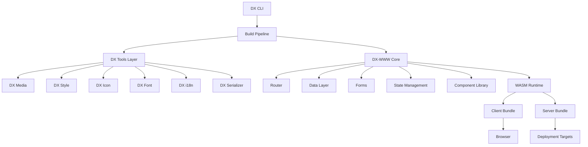
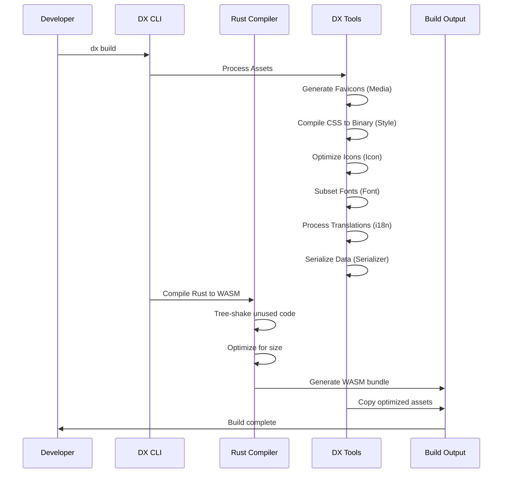
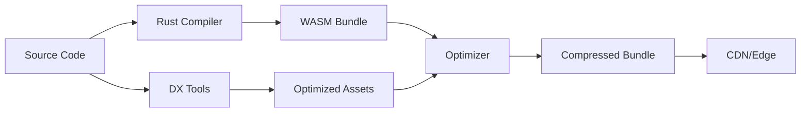

# DX-WWW Production Ready - Design Document

## Overview

This design transforms DX-WWW from a proof-of-concept into a production-ready framework by integrating all DX ecosystem tools and implementing missing features. The architecture follows a binary-first approach with zero-cost abstractions, leveraging Rust's compile-time guarantees and WebAssembly's performance.

**Core Principles:**
- Binary everywhere (no JSON parsing overhead)
- Compile-time optimization (tree-shaking, dead code elimination)
- Zero-cost abstractions (stack-only allocation)
- LLM-optimized formats (52-73% token savings)

---

## Architecture

### High-Level System Architecture



### Build Pipeline Architecture



---

## Components and Interfaces

### 1. DX Tool Integration Layer

#### 1.1 DX Media Integration

**Purpose:** Generate optimized favicons from source logos

**Module Structure:**
```rust
// crates/www/build/src/media.rs
pub struct MediaProcessor {
    cache: PathBuf,
    config: MediaConfig,
}

pub struct MediaConfig {
    pub logo_path: PathBuf,
    pub output_dir: PathBuf,
    pub sizes: Vec<FaviconSize>,
}

pub enum FaviconSize {
    Ico16,
    Ico32,
    Ico48,
    Png16,
    Png32,
    AppleTouch180,
    AndroidChrome192,
    AndroidChrome512,
}

impl MediaProcessor {
    pub fn generate_favicons(&self) -> Result<FaviconManifest, MediaError>;
    pub fn generate_manifest_json(&self, favicons: &FaviconManifest) -> Result<String, MediaError>;
}
```

**Integration Point:**
- Called during `dx build` before WASM compilation
- Outputs cached in `.dx/cache/favicons/{hash}/`
- Manifest injected into HTML `<head>`

**Data Flow:**
1. Read `extension/media/logo.png`
2. Call `dx-media` CLI with size specifications
3. Cache outputs with content hash
4. Generate `manifest.json` with icon references
5. Inject `<link>` tags into HTML template


#### 1.2 DX Style Integration (Binary Dawn CSS)

**Purpose:** Compile CSS to Binary Dawn format for 98% faster loading

**Module Structure:**
```rust
// crates/www/build/src/style.rs
pub struct StyleProcessor {
    input_dir: PathBuf,
    output_dir: PathBuf,
    config: StyleConfig,
}

pub struct StyleConfig {
    pub auto_grouping: bool,
    pub similarity_threshold: f32,
    pub compression_level: u8,
}

impl StyleProcessor {
    pub fn compile_to_binary(&self) -> Result<BinaryStyleBundle, StyleError>;
    pub fn generate_loader(&self) -> Result<String, StyleError>;
}

pub struct BinaryStyleBundle {
    pub data: Vec<u8>,
    pub hash: String,
    pub size: usize,
}
```

**Integration Point:**
- Processes all `.css` files in `www/styles/`
- Generates `.dxbd` binary format
- WASM runtime loader decodes and applies styles

**Data Flow:**
1. Scan `www/styles/` for CSS files
2. Call `dx-style` with auto-grouping enabled
3. Generate Binary Dawn CSS (`.dxbd`)
4. Embed loader in WASM client
5. Runtime: decode binary → apply to DOM


#### 1.3 DX Icon Integration

**Purpose:** Provide 297,000+ icons with zero runtime overhead

**Module Structure:**
```rust
// crates/www/framework-core/src/icon.rs
pub struct IconComponent {
    pub name: String,
    pub size: u32,
    pub color: Option<String>,
}

// Compile-time macro
#[macro_export]
macro_rules! icon {
    ($name:expr) => {
        compile_time_icon!($name)
    };
}

// Build-time processor
pub struct IconProcessor {
    cache: PathBuf,
    used_icons: HashSet<String>,
}

impl IconProcessor {
    pub fn resolve_icon(&self, name: &str) -> Result<SvgData, IconError>;
    pub fn tree_shake(&self) -> Result<Vec<SvgData>, IconError>;
}
```

**Integration Point:**
- Component syntax: `<dx-icon name="heroicons:home" />`
- Compile-time resolution via macro
- Tree-shaking removes unused icons

**Data Flow:**
1. Parse component tree for `<dx-icon>` usage
2. Extract icon names
3. Call `dx-icon` to fetch SVG data
4. Inline optimized SVG at compile time
5. Dead code elimination removes unused icons


#### 1.4 DX Font Integration

**Purpose:** Automatic font subsetting for minimal file sizes

**Module Structure:**
```rust
// crates/www/build/src/font.rs
pub struct FontProcessor {
    cache: PathBuf,
    config: FontConfig,
}

pub struct FontConfig {
    pub fonts: Vec<FontSpec>,
    pub output_format: FontFormat,
}

pub struct FontSpec {
    pub family: String,
    pub weights: Vec<u16>,
    pub subsets: Vec<String>,
}

pub enum FontFormat {
    Woff2,
    Woff,
    Ttf,
}

impl FontProcessor {
    pub fn download_and_subset(&self, text_content: &str) -> Result<Vec<FontFile>, FontError>;
    pub fn generate_preload_hints(&self, fonts: &[FontFile]) -> Result<String, FontError>;
}
```

**Integration Point:**
- Analyzes all text content in components
- Downloads fonts from free sources
- Subsets to used characters only
- Generates preload hints

**Data Flow:**
1. Extract all text from components
2. Determine character set
3. Call `dx-font` with character list
4. Download and subset fonts
5. Generate WOFF2 files
6. Inject preload hints in HTML


#### 1.5 DX i18n Integration

**Purpose:** Built-in internationalization with minimal overhead

**Module Structure:**
```rust
// crates/www/i18n/src/lib.rs
pub struct I18nManager {
    locale: Locale,
    translations: HashMap<String, TranslationBundle>,
    fallback: Locale,
}

pub struct TranslationBundle {
    data: Vec<u8>, // DX Serializer format
    locale: Locale,
}

#[macro_export]
macro_rules! t {
    ($key:expr) => {
        I18nManager::translate($key)
    };
    ($key:expr, $($arg:tt)*) => {
        I18nManager::translate_with_args($key, format_args!($($arg)*))
    };
}

impl I18nManager {
    pub fn detect_locale() -> Locale;
    pub fn load_bundle(&mut self, locale: Locale) -> Result<(), I18nError>;
    pub fn translate(&self, key: &str) -> String;
    pub fn format_number(&self, num: f64) -> String;
    pub fn format_date(&self, date: DateTime) -> String;
}
```

**Integration Point:**
- `t!("key")` macro in components
- Lazy loading of translation bundles
- Browser locale detection

**Data Flow:**
1. Detect browser locale
2. Load translation bundle (DX Serializer format)
3. Macro expands to translation lookup
4. Fallback to default locale if missing


#### 1.6 DX Serializer Integration

**Purpose:** Use DX Serializer format for all data (52-73% smaller)

**Module Structure:**
```rust
// crates/www/serializer/src/lib.rs
pub trait DxSerialize {
    fn to_dx_bytes(&self) -> Result<Vec<u8>, SerializerError>;
    fn from_dx_bytes(data: &[u8]) -> Result<Self, SerializerError> where Self: Sized;
}

pub struct DxSerializer {
    format: SerializerFormat,
}

pub enum SerializerFormat {
    Machine,  // Binary format for production
    Llm,      // Human-readable for debugging
}

impl DxSerializer {
    pub fn serialize<T: DxSerialize>(&self, value: &T) -> Result<Vec<u8>, SerializerError>;
    pub fn deserialize<T: DxSerialize>(&self, data: &[u8]) -> Result<T, SerializerError>;
}
```

**Integration Point:**
- Config files use `.sr` format
- API responses use DX Machine format
- State serialization uses DX format
- Translation files use DX format

**Data Flow:**
1. Define data structures with `#[derive(DxSerialize)]`
2. Serialize to binary format
3. Transmit/store binary data
4. Deserialize on demand
5. Zero-copy deserialization where possible


---

## 2. Core Missing Features

### 2.1 File-Based Routing System

**Purpose:** Next.js-style file-based routing with dynamic routes

**Module Structure:**
```rust
// crates/www/router/src/lib.rs
pub struct Router {
    routes: Vec<Route>,
    current: Option<RouteMatch>,
}

pub struct Route {
    pub path: PathPattern,
    pub component: ComponentId,
    pub guards: Vec<RouteGuard>,
}

pub enum PathPattern {
    Static(String),
    Dynamic { segments: Vec<Segment> },
}

pub enum Segment {
    Static(String),
    Param(String),
    CatchAll(String),
}

pub struct RouteMatch {
    pub route: Route,
    pub params: HashMap<String, String>,
}

impl Router {
    pub fn from_pages_dir(dir: &Path) -> Result<Self, RouterError>;
    pub fn navigate(&mut self, path: &str) -> Result<RouteMatch, RouterError>;
    pub fn prefetch(&self, path: &str) -> Result<(), RouterError>;
}
```

**File Mapping:**
- `www/pages/index.pg` → `/`
- `www/pages/about.pg` → `/about`
- `www/pages/blog/[slug].pg` → `/blog/:slug`
- `www/pages/posts/[...path].pg` → `/posts/*`

**Navigation API:**
```rust
// Component usage
use dx_www::router::Link;

Link::new("/about")
    .prefetch(true)
    .class("nav-link")
    .child(text("About"));
```


### 2.2 Data Fetching System

**Purpose:** Built-in data fetching with caching and optimistic updates

**Module Structure:**
```rust
// crates/www/query/src/lib.rs
pub struct QueryClient {
    cache: QueryCache,
    config: QueryConfig,
}

pub struct QueryCache {
    entries: HashMap<QueryKey, CacheEntry>,
    ttl: Duration,
}

pub struct CacheEntry {
    data: Vec<u8>, // DX Serializer format
    timestamp: Instant,
    status: QueryStatus,
}

pub enum QueryStatus {
    Fresh,
    Stale,
    Error(String),
}

// Hook API
pub fn use_query<T: DxSerialize>(
    key: &str,
    fetcher: impl Fn() -> Future<Output = Result<T>>,
) -> QueryResult<T>;

pub fn use_mutation<T: DxSerialize>(
    mutator: impl Fn(T) -> Future<Output = Result<T>>,
) -> MutationResult<T>;

pub struct QueryResult<T> {
    pub data: Option<T>,
    pub loading: bool,
    pub error: Option<String>,
    pub refetch: Box<dyn Fn()>,
}
```

**Caching Strategy:**
- In-memory cache with TTL
- Request deduplication (same key = single request)
- Stale-while-revalidate pattern
- Optimistic updates for mutations

**Data Flow:**
1. Component calls `use_query("users", fetch_users)`
2. Check cache for fresh data
3. If stale, return cached + fetch in background
4. If missing, show loading + fetch
5. Update cache and re-render on response


### 2.3 Form Handling System

**Purpose:** Type-safe form validation with accessibility

**Module Structure:**
```rust
// crates/www/form/src/lib.rs
pub struct Form<T> {
    fields: Vec<Field>,
    validators: Vec<Validator>,
    state: FormState<T>,
}

pub struct Field {
    pub name: String,
    pub value: String,
    pub error: Option<String>,
    pub touched: bool,
}

pub enum Validator {
    Required,
    Email,
    Url,
    MinLength(usize),
    MaxLength(usize),
    Pattern(Regex),
    Custom(Box<dyn Fn(&str) -> Result<(), String>>),
    Async(Box<dyn Fn(&str) -> Future<Output = Result<(), String>>>),
}

pub struct FormState<T> {
    pub values: T,
    pub errors: HashMap<String, String>,
    pub touched: HashSet<String>,
    pub submitting: bool,
    pub valid: bool,
}

impl<T> Form<T> {
    pub fn validate_field(&mut self, name: &str) -> Result<(), ValidationError>;
    pub fn validate_all(&mut self) -> Result<(), ValidationError>;
    pub fn submit(&mut self) -> Result<T, ValidationError>;
}
```

**Validation Flow:**
1. User types in field
2. On blur: validate field
3. Show error if invalid
4. On submit: validate all fields
5. If valid: call submit handler
6. If async validation: show loading state

**Accessibility:**
- ARIA labels auto-generated
- Error announcements via `aria-live`
- Focus management on errors
- Keyboard navigation support


### 2.4 State Management System

**Purpose:** Reactive state with minimal overhead

**Module Structure:**
```rust
// crates/www/state/src/lib.rs
pub struct Store<T> {
    state: Arc<RwLock<T>>,
    subscribers: Vec<Subscriber>,
    middleware: Vec<Middleware>,
}

pub struct Subscriber {
    id: SubscriberId,
    callback: Box<dyn Fn(&StateChange)>,
}

pub trait Middleware {
    fn before_update(&self, old: &State, new: &State);
    fn after_update(&self, old: &State, new: &State);
}

// Hook API
pub fn use_state<T>(initial: T) -> (T, Box<dyn Fn(T)>);
pub fn use_effect<F: Fn()>(effect: F, deps: &[Dependency]);

// Global store
pub fn create_store<T>(initial: T) -> Store<T>;

impl<T> Store<T> {
    pub fn get(&self) -> T;
    pub fn set(&self, value: T);
    pub fn update(&self, updater: impl Fn(&mut T));
    pub fn subscribe(&mut self, callback: impl Fn(&StateChange)) -> SubscriberId;
}
```

**Reactivity Model:**
- Fine-grained reactivity (only affected components re-render)
- Batched updates (multiple state changes = single render)
- Computed values (memoized derived state)
- Persistence via localStorage middleware

**Data Flow:**
1. Component calls `use_state(0)`
2. Returns current value + setter
3. Setter called → state updated
4. Subscribers notified
5. Component re-renders with new value


### 2.5 Component Library

**Purpose:** Pre-built accessible UI components

**Module Structure:**
```rust
// crates/www/components/src/lib.rs
pub mod button;
pub mod input;
pub mod card;
pub mod modal;
pub mod table;

// Example: Button component
pub struct Button {
    pub variant: ButtonVariant,
    pub size: ButtonSize,
    pub disabled: bool,
    pub loading: bool,
    pub on_click: Option<Box<dyn Fn()>>,
}

pub enum ButtonVariant {
    Primary,
    Secondary,
    Danger,
    Ghost,
}

pub enum ButtonSize {
    Small,
    Medium,
    Large,
}

impl Button {
    pub fn render(&self) -> Element;
}
```

**Component Categories:**
- **Form Controls:** Button, Input, Select, Checkbox, Radio
- **Layout:** Card, Modal, Dialog, Drawer
- **Data Display:** Table, List, Grid
- **Navigation:** Tabs, Accordion, Collapse
- **Feedback:** Toast, Alert, Badge, Spinner
- **Overlay:** Dropdown, Menu, Popover
- **Pickers:** Date Picker, Time Picker

**Theming:**
- CSS custom properties for colors
- Size tokens (spacing, typography)
- Dark mode support
- Theme customization API


---

## 3. Developer Experience

### 3.1 CLI Tool (`dx create`)

**Purpose:** Scaffold new projects quickly

**Module Structure:**
```rust
// crates/cli/src/create.rs
pub struct CreateCommand {
    pub name: String,
    pub template: Template,
    pub options: CreateOptions,
}

pub enum Template {
    Blog,
    Dashboard,
    Ecommerce,
    Landing,
    Custom(String),
}

pub struct CreateOptions {
    pub git_init: bool,
    pub install_deps: bool,
    pub open_editor: bool,
}

impl CreateCommand {
    pub fn run(&self) -> Result<(), CreateError>;
    fn scaffold_project(&self) -> Result<PathBuf, CreateError>;
    fn copy_template(&self, dest: &Path) -> Result<(), CreateError>;
    fn init_git(&self, path: &Path) -> Result<(), CreateError>;
    fn install_dependencies(&self, path: &Path) -> Result<(), CreateError>;
}
```

**Template Structure:**
```
templates/
├── blog/
│   ├── www/
│   │   ├── pages/
│   │   │   ├── index.pg
│   │   │   └── posts/[slug].pg
│   │   └── styles/
│   ├── Cargo.toml
│   └── README.md
├── dashboard/
└── ecommerce/
```

**Interactive Prompts:**
1. Project name
2. Template selection
3. Git initialization (Y/n)
4. Install dependencies (Y/n)
5. Open in editor (Y/n)


### 3.2 Hot Module Replacement

**Purpose:** Instant updates without page refresh

**Module Structure:**
```rust
// crates/www/dev-server/src/hmr.rs
pub struct HmrServer {
    watcher: FileWatcher,
    clients: Vec<WebSocketClient>,
    compiler: IncrementalCompiler,
}

pub struct FileWatcher {
    paths: Vec<PathBuf>,
    debounce: Duration,
}

pub struct IncrementalCompiler {
    cache: CompilationCache,
    dependency_graph: DependencyGraph,
}

impl HmrServer {
    pub fn watch(&mut self) -> Result<(), HmrError>;
    pub fn on_file_change(&mut self, path: &Path) -> Result<(), HmrError>;
    pub fn recompile_module(&mut self, path: &Path) -> Result<Module, HmrError>;
    pub fn notify_clients(&self, update: HmrUpdate) -> Result<(), HmrError>;
}

pub struct HmrUpdate {
    pub module_id: String,
    pub code: Vec<u8>,
    pub dependencies: Vec<String>,
}
```

**Update Flow:**
1. File watcher detects change
2. Determine affected modules via dependency graph
3. Recompile only changed modules
4. Send update to browser via WebSocket
5. Browser applies patch without reload
6. Preserve component state

**State Preservation:**
- Store component state before update
- Apply new code
- Restore state to new component
- Re-render with preserved state


### 3.3 DevTools Browser Extension

**Purpose:** Debug DX-WWW apps in browser

**Module Structure:**
```rust
// crates/www/devtools/src/lib.rs
pub struct DevTools {
    pub component_tree: ComponentTree,
    pub state_inspector: StateInspector,
    pub profiler: Profiler,
    pub network: NetworkMonitor,
}

pub struct ComponentTree {
    root: ComponentNode,
}

pub struct ComponentNode {
    pub id: ComponentId,
    pub name: String,
    pub props: HashMap<String, Value>,
    pub state: HashMap<String, Value>,
    pub children: Vec<ComponentNode>,
}

pub struct StateInspector {
    stores: Vec<StoreSnapshot>,
}

pub struct Profiler {
    pub render_times: Vec<RenderMetric>,
    pub flame_graph: FlameGraph,
}
```

**Features:**
- Component tree with props/state inspection
- State editor (modify values live)
- Performance profiler with flame graph
- Network request log
- HTIP operation timeline
- Time-travel debugging

**Communication:**
- Browser extension injects script
- Script connects to WASM runtime
- Bidirectional message passing
- Updates sent on state changes


### 3.4 Error Messages

**Purpose:** Helpful error messages for fast debugging

**Module Structure:**
```rust
// crates/www/errors/src/lib.rs
pub struct DxError {
    pub code: ErrorCode,
    pub message: String,
    pub file: Option<PathBuf>,
    pub line: Option<usize>,
    pub column: Option<usize>,
    pub suggestion: Option<String>,
    pub docs_link: Option<String>,
}

pub enum ErrorCode {
    CompileError(u32),
    RuntimeError(u32),
    ValidationError(u32),
}

impl DxError {
    pub fn format_terminal(&self) -> String;
    pub fn format_browser(&self) -> String;
}
```

**Error Categories:**
- **Compile-time:** Type errors, syntax errors, missing imports
- **Runtime:** Null pointer, out of bounds, network errors
- **Validation:** Form validation, data validation

**Error Format:**
```
Error DX-1001: Component not found

  --> www/pages/index.pg:12:5
   |
12 |     <MyComponent />
   |     ^^^^^^^^^^^^^ Component 'MyComponent' is not imported
   |
   = help: Did you mean 'MyButton'?
   = docs: https://dx.dev/errors/1001
```


---

## 4. Production Features

### 4.1 Build Optimization Pipeline

**Purpose:** Minimize bundle size and maximize performance

**Module Structure:**
```rust
// crates/www/build/src/optimizer.rs
pub struct BuildOptimizer {
    config: OptimizationConfig,
}

pub struct OptimizationConfig {
    pub tree_shaking: bool,
    pub dead_code_elimination: bool,
    pub minification: bool,
    pub code_splitting: bool,
    pub compression: CompressionLevel,
}

pub enum CompressionLevel {
    None,
    Gzip,
    Brotli,
}

impl BuildOptimizer {
    pub fn optimize(&self, bundle: Bundle) -> Result<OptimizedBundle, OptimizerError>;
    fn tree_shake(&self, bundle: &mut Bundle) -> Result<(), OptimizerError>;
    fn eliminate_dead_code(&self, bundle: &mut Bundle) -> Result<(), OptimizerError>;
    fn split_by_route(&self, bundle: Bundle) -> Result<Vec<Chunk>, OptimizerError>;
    fn minify(&self, code: &[u8]) -> Result<Vec<u8>, OptimizerError>;
    fn compress(&self, data: &[u8]) -> Result<Vec<u8>, OptimizerError>;
}
```

**Optimization Stages:**
1. **Tree-shaking:** Remove unused exports
2. **Dead code elimination:** Remove unreachable code
3. **Code splitting:** Split by route for lazy loading
4. **Minification:** Reduce WASM size
5. **Compression:** Brotli compression
6. **Asset optimization:** Optimize images, fonts

**Bundle Analysis:**
- Generate size report
- Identify large dependencies
- Suggest optimizations


### 4.2 Deployment Adapters

**Purpose:** Deploy to multiple platforms easily

**Module Structure:**
```rust
// crates/www/deploy/src/lib.rs
pub trait DeployAdapter {
    fn deploy(&self, bundle: &Bundle) -> Result<DeploymentResult, DeployError>;
    fn validate_config(&self) -> Result<(), DeployError>;
}

pub struct VercelAdapter {
    config: VercelConfig,
}

pub struct NetlifyAdapter {
    config: NetlifyConfig,
}

pub struct CloudflareAdapter {
    config: CloudflareConfig,
}

pub struct StaticAdapter {
    output_dir: PathBuf,
}

impl DeployAdapter for VercelAdapter {
    fn deploy(&self, bundle: &Bundle) -> Result<DeploymentResult, DeployError> {
        // Upload to Vercel
        // Configure serverless functions
        // Set environment variables
    }
}
```

**Adapter Features:**
- **Vercel:** Serverless functions, edge runtime
- **Netlify:** Edge functions, redirects
- **Cloudflare Workers:** Edge computing
- **Static:** Pre-rendered HTML files
- **Docker:** Container image

**Configuration:**
```rust
// dx.config.toml
[deploy]
adapter = "vercel"
region = "us-east-1"

[deploy.vercel]
project_id = "prj_xxx"
team_id = "team_xxx"
```


### 4.3 Performance Monitoring

**Purpose:** Track Core Web Vitals and custom metrics

**Module Structure:**
```rust
// crates/www/monitoring/src/lib.rs
pub struct PerformanceMonitor {
    metrics: Vec<Metric>,
    config: MonitoringConfig,
}

pub enum Metric {
    CoreWebVital(CoreWebVital),
    Custom { name: String, value: f64, unit: String },
}

pub enum CoreWebVital {
    LCP(f64),  // Largest Contentful Paint
    FID(f64),  // First Input Delay
    CLS(f64),  // Cumulative Layout Shift
    FCP(f64),  // First Contentful Paint
    TTFB(f64), // Time to First Byte
}

impl PerformanceMonitor {
    pub fn track_cwv(&mut self) -> Result<(), MonitoringError>;
    pub fn track_custom(&mut self, name: &str, value: f64) -> Result<(), MonitoringError>;
    pub fn send_to_backend(&self) -> Result<(), MonitoringError>;
}
```

**Metrics Collected:**
- Core Web Vitals (LCP, FID, CLS)
- Custom timing marks
- Error rates
- Network performance
- WASM load time


### 4.4 Security Hardening

**Purpose:** Secure defaults and protection mechanisms

**Module Structure:**
```rust
// crates/www/security/src/lib.rs
pub struct SecurityConfig {
    pub csp: ContentSecurityPolicy,
    pub csrf: CsrfProtection,
    pub rate_limiting: RateLimiter,
}

pub struct ContentSecurityPolicy {
    pub directives: HashMap<String, Vec<String>>,
}

pub struct CsrfProtection {
    pub token_length: usize,
    pub cookie_name: String,
}

pub struct RateLimiter {
    pub requests_per_minute: u32,
    pub burst_size: u32,
}

impl SecurityConfig {
    pub fn generate_headers(&self) -> HashMap<String, String>;
    pub fn validate_csrf_token(&self, token: &str) -> bool;
    pub fn check_rate_limit(&self, ip: &str) -> Result<(), RateLimitError>;
}
```

**Security Features:**
- CSP headers (prevent XSS)
- CSRF tokens
- Input sanitization
- Rate limiting
- Secure headers (HSTS, X-Frame-Options)
- SQL injection prevention (parameterized queries)


---

## Data Models

### Build Artifact Model

```rust
pub struct BuildArtifact {
    pub wasm_bundle: WasmBundle,
    pub assets: Vec<Asset>,
    pub manifest: BuildManifest,
}

pub struct WasmBundle {
    pub data: Vec<u8>,
    pub hash: String,
    pub size: usize,
    pub compressed_size: usize,
}

pub struct Asset {
    pub path: PathBuf,
    pub content_type: String,
    pub data: Vec<u8>,
    pub hash: String,
}

pub struct BuildManifest {
    pub version: String,
    pub routes: Vec<RouteEntry>,
    pub chunks: Vec<ChunkEntry>,
    pub assets: HashMap<String, String>, // path -> hash
}
```

### Component Model

```rust
pub struct Component {
    pub id: ComponentId,
    pub name: String,
    pub props: Props,
    pub state: State,
    pub children: Vec<Component>,
}

pub struct Props {
    values: HashMap<String, PropValue>,
}

pub enum PropValue {
    String(String),
    Number(f64),
    Boolean(bool),
    Function(Box<dyn Fn()>),
}

pub struct State {
    values: HashMap<String, StateValue>,
}
```

### Route Model

```rust
pub struct RouteEntry {
    pub pattern: String,
    pub component: String,
    pub chunk: Option<String>,
    pub preload: Vec<String>,
}

pub struct ChunkEntry {
    pub id: String,
    pub files: Vec<String>,
    pub size: usize,
}
```


---

## Correctness Properties

*A property is a characteristic or behavior that should hold true across all valid executions of a system—essentially, a formal statement about what the system should do. Properties serve as the bridge between human-readable specifications and machine-verifiable correctness guarantees.*

### DX Tool Integration Properties

**Property 1: Favicon Generation Completeness**
*For any* valid source logo image, generating favicons should produce all required sizes (16x16, 32x32, 48x48, 180x180, 192x192, 512x512) and formats (ICO, PNG).
**Validates: Requirements 1.1**

**Property 2: Manifest Icon References**
*For any* generated favicon set, the manifest.json should contain valid references to all generated icon files.
**Validates: Requirements 1.1**

**Property 3: CSS File Discovery**
*For any* set of CSS files in www/styles/, the style processor should discover and process all of them.
**Validates: Requirements 1.2**

**Property 4: Binary CSS Round Trip**
*For any* valid CSS input, compiling to Binary Dawn format then decoding should produce equivalent styles.
**Validates: Requirements 1.2**

**Property 5: Icon Tree Shaking**
*For any* component tree, the final bundle should only contain icons that are actually referenced in components.
**Validates: Requirements 1.3**

**Property 6: Font Subsetting Accuracy**
*For any* text content and font, the subsetted font should contain exactly the characters used in the content.
**Validates: Requirements 1.4**

**Property 7: Translation Serialization Round Trip**
*For any* translation bundle, serializing to DX format then deserializing should produce an equivalent bundle.
**Validates: Requirements 1.5, 1.6**

**Property 8: DX Serializer Round Trip**
*For any* data structure implementing DxSerialize, serializing then deserializing should produce an equivalent value.
**Validates: Requirements 1.6**


### Routing Properties

**Property 9: File-to-Route Mapping**
*For any* page file in www/pages/, the router should generate a route that matches the file path convention (e.g., about.pg → /about).
**Validates: Requirements 2.1**

**Property 10: Dynamic Route Parameter Extraction**
*For any* dynamic route pattern (e.g., [id].pg) and matching URL, the router should correctly extract parameters.
**Validates: Requirements 2.1**

**Property 11: Client-Side Navigation Preservation**
*For any* client-side navigation, no full page reload should occur (no HTTP request for HTML).
**Validates: Requirements 2.1**

### Data Fetching Properties

**Property 12: Query Cache Consistency**
*For any* query within its TTL, repeated calls should return cached data without additional network requests.
**Validates: Requirements 2.2**

**Property 13: Request Deduplication**
*For any* set of simultaneous identical queries, only one network request should be made.
**Validates: Requirements 2.2**

### Form Validation Properties

**Property 14: Email Validator Correctness**
*For any* string, the email validator should correctly identify valid email addresses according to RFC 5322.
**Validates: Requirements 2.3**

**Property 15: Validation Error Messages**
*For any* invalid form input, validation should produce a descriptive error message.
**Validates: Requirements 2.3**

**Property 16: Form Validation Completeness**
*For any* form with multiple fields, form-level validation should check all fields before submission.
**Validates: Requirements 2.3**


### State Management Properties

**Property 17: State Update Reactivity**
*For any* component using useState, updating state should trigger a re-render with the new value.
**Validates: Requirements 2.4**

**Property 18: Global Store Propagation**
*For any* global store update, all subscribed components should receive the update.
**Validates: Requirements 2.4**

**Property 19: State Persistence Round Trip**
*For any* persisted state, saving to localStorage then loading should produce an equivalent state.
**Validates: Requirements 2.4**

### Component Library Properties

**Property 20: Component Accessibility**
*For any* component in the library, automated accessibility checks should pass WCAG AA standards.
**Validates: Requirements 2.5**

### Developer Experience Properties

**Property 21: HMR State Preservation**
*For any* component with state, hot module replacement should preserve the state across updates.
**Validates: Requirements 3.2**

**Property 22: Incremental Compilation Correctness**
*For any* file change, incremental compilation should produce the same output as a full rebuild.
**Validates: Requirements 3.2**

**Property 23: Error Location Accuracy**
*For any* compile-time error, the error message should include the correct file path and line number.
**Validates: Requirements 3.4**


### Build Optimization Properties

**Property 24: Tree Shaking Completeness**
*For any* module with unused exports, those exports should not appear in the final bundle.
**Validates: Requirements 4.1**

**Property 25: Code Splitting by Route**
*For any* multi-route application, each route should be in a separate chunk that can be lazy-loaded.
**Validates: Requirements 4.1**

**Property 26: Compression Round Trip**
*For any* compressed bundle, decompressing should produce the original uncompressed data.
**Validates: Requirements 4.1**

### Security Properties

**Property 27: CSRF Token Validation**
*For any* form submission without a valid CSRF token, the request should be rejected.
**Validates: Requirements 4.4**

**Property 28: XSS Input Sanitization**
*For any* user input containing script tags or event handlers, the sanitizer should escape or remove them.
**Validates: Requirements 4.4**

**Property 29: CSP Header Presence**
*For any* HTTP response serving HTML, Content-Security-Policy headers should be present.
**Validates: Requirements 4.4**

---

## Error Handling

### Error Categories

**Build-Time Errors:**
- Invalid syntax in page files
- Missing dependencies
- Type errors in Rust code
- Asset processing failures

**Runtime Errors:**
- Network request failures
- Invalid data from API
- Component rendering errors
- State update errors

**Validation Errors:**
- Form validation failures
- Route parameter validation
- Configuration validation


### Error Recovery Strategies

**Build-Time:**
- Clear error messages with file/line/column
- Suggestions for common mistakes
- Links to documentation
- Continue building other modules when possible

**Runtime:**
- Error boundaries to catch component errors
- Fallback UI for failed components
- Retry logic for network requests
- Graceful degradation for missing features

**Validation:**
- Field-level error messages
- Form-level error summary
- Accessibility announcements
- Focus management to first error

### Error Propagation

```rust
pub enum DxError {
    Build(BuildError),
    Runtime(RuntimeError),
    Validation(ValidationError),
}

impl DxError {
    pub fn is_recoverable(&self) -> bool;
    pub fn user_message(&self) -> String;
    pub fn developer_message(&self) -> String;
}
```

---

## Testing Strategy

### Dual Testing Approach

DX-WWW uses both unit tests and property-based tests for comprehensive coverage:

**Unit Tests:**
- Specific examples demonstrating correct behavior
- Edge cases (empty inputs, boundary values)
- Error conditions and error handling
- Integration points between components

**Property-Based Tests:**
- Universal properties that hold for all inputs
- Comprehensive input coverage through randomization
- Minimum 100 iterations per property test
- Each property test references its design document property

**Together:** Unit tests catch concrete bugs, property tests verify general correctness.


### Property-Based Testing Configuration

**Library:** `proptest` (Rust's property-based testing framework)

**Configuration:**
- Minimum 100 iterations per property test
- Each test tagged with feature name and property number
- Tag format: `// Feature: dx-www-production-ready, Property N: [property text]`

**Example Property Test:**
```rust
use proptest::prelude::*;

// Feature: dx-www-production-ready, Property 8: DX Serializer Round Trip
proptest! {
    #[test]
    fn serializer_round_trip(data: ArbitraryData) {
        let serialized = data.to_dx_bytes().unwrap();
        let deserialized = ArbitraryData::from_dx_bytes(&serialized).unwrap();
        assert_eq!(data, deserialized);
    }
}
```

### Test Organization

**Unit Tests:**
```
crates/www/
├── router/
│   ├── src/
│   │   └── lib.rs
│   └── tests/
│       ├── unit/
│       │   ├── static_routes.rs
│       │   └── dynamic_routes.rs
│       └── properties/
│           └── route_mapping.rs
```

**Integration Tests:**
```
tests/
├── integration/
│   ├── routing_integration.rs
│   ├── data_fetching_integration.rs
│   └── form_validation_integration.rs
```

### Coverage Goals

- **Overall:** 95%+ code coverage
- **Critical paths:** 100% coverage (routing, serialization, security)
- **Property tests:** All correctness properties implemented
- **Unit tests:** Edge cases and error conditions
- **Integration tests:** End-to-end workflows

### Browser Compatibility Testing

**Target Browsers:**
- Chrome/Edge (last 2 versions)
- Firefox (last 2 versions)
- Safari (last 2 versions)
- iOS Safari (last 2 versions)
- Chrome Android (last 2 versions)

**Testing Strategy:**
- Automated tests via Playwright/WebDriver
- Visual regression tests
- Performance benchmarks per browser
- Accessibility tests (axe-core)

---

## Performance Considerations

### Bundle Size Targets

- **Client (tiny):** 338 bytes
- **Client (full):** 7.5KB
- **Per-route chunk:** < 5KB
- **Total app (5 routes):** < 50KB

### Optimization Techniques

**Compile-Time:**
- Tree-shaking unused code
- Dead code elimination
- Constant folding
- Inline small functions

**Runtime:**
- Zero-copy deserialization
- Stack-only allocation
- Direct DOM manipulation
- Batched updates

**Network:**
- Brotli compression
- HTTP/2 multiplexing
- Resource hints (preload, prefetch)
- Code splitting by route

### Performance Budgets

- **LCP:** < 2.5s
- **FID:** < 100ms
- **CLS:** < 0.1
- **TTFB:** < 600ms
- **Bundle size:** < 50KB total

---

## Security Considerations

### Threat Model

**Client-Side Threats:**
- XSS attacks via user input
- CSRF attacks on forms
- Malicious scripts in third-party content

**Server-Side Threats:**
- SQL injection (if using database)
- Path traversal attacks
- Rate limiting bypass

### Mitigation Strategies

**Input Validation:**
- Whitelist validation for all inputs
- Escape HTML entities
- Sanitize URLs
- Validate file uploads

**Output Encoding:**
- Context-aware encoding
- CSP to prevent inline scripts
- Subresource Integrity (SRI)

**Authentication & Authorization:**
- Secure session management
- CSRF tokens on all mutations
- Rate limiting per IP
- Secure password hashing (if applicable)

---

## Deployment Architecture

### Build Pipeline



### Deployment Targets

**Static Hosting:**
- Pre-rendered HTML
- WASM + assets on CDN
- No server required

**Serverless:**
- Edge functions for SSR
- API routes as serverless functions
- Global distribution

**Container:**
- Docker image with server
- Kubernetes deployment
- Auto-scaling

### CI/CD Pipeline

1. **Build:** Compile Rust to WASM
2. **Test:** Run unit + property + integration tests
3. **Lint:** cargo clippy + cargo fmt check
4. **Optimize:** Tree-shake + minify + compress
5. **Deploy:** Upload to target platform
6. **Verify:** Smoke tests on production

---

## Migration Strategy

### From React/Next.js

**Component Migration:**
- React components → DX-WWW components
- useState → use_state
- useEffect → use_effect
- React Router → DX-WWW Router

**Data Fetching:**
- React Query → use_query
- SWR → use_query
- fetch → use_query

**Styling:**
- CSS Modules → Binary Dawn CSS
- Tailwind → Binary Dawn CSS
- Styled Components → Binary Dawn CSS

### Automated Migration Tool

```rust
// crates/cli/src/migrate.rs
pub struct MigrationTool {
    source_dir: PathBuf,
    target_dir: PathBuf,
}

impl MigrationTool {
    pub fn migrate_react_component(&self, file: &Path) -> Result<String, MigrationError>;
    pub fn migrate_hooks(&self, code: &str) -> Result<String, MigrationError>;
    pub fn migrate_routing(&self, routes: &[Route]) -> Result<String, MigrationError>;
}
```

---

## Documentation Strategy

### API Documentation

**Auto-Generated:**
- Rust doc comments → API docs
- Type signatures included
- Examples for each function
- Search functionality

**Manual:**
- Conceptual guides
- Best practices
- Architecture decisions
- Migration guides

### Example Applications

**Blog:**
- File-based routing
- Markdown content
- SEO optimization
- RSS feed

**Dashboard:**
- Data visualization
- Real-time updates
- Authentication
- Role-based access

**E-commerce:**
- Product catalog
- Shopping cart
- Checkout flow
- Payment integration

**Todo App:**
- State management
- Local persistence
- Drag and drop
- Keyboard shortcuts

**Chat App:**
- WebSocket connection
- Real-time messages
- User presence
- Message history

### Documentation Site

**Structure:**
```
docs/
├── getting-started/
│   ├── installation.md
│   ├── first-app.md
│   └── core-concepts.md
├── guides/
│   ├── routing.md
│   ├── data-fetching.md
│   ├── forms.md
│   └── state-management.md
├── api/
│   ├── components.md
│   ├── hooks.md
│   └── utilities.md
├── examples/
│   ├── blog.md
│   ├── dashboard.md
│   └── ecommerce.md
└── migration/
    ├── from-react.md
    └── from-nextjs.md
```

---

## Future Enhancements

### Phase 2 (Post-MVP)

- Visual editor for components
- AI code generation
- Mobile app support (React Native alternative)
- Desktop app support (Electron alternative)
- Plugin marketplace

### Phase 3 (Long-term)

- Real-time collaboration
- Visual regression testing
- A/B testing framework
- Analytics dashboard
- Performance monitoring dashboard

---

## Conclusion

This design provides a comprehensive architecture for transforming DX-WWW into a production-ready framework. The binary-first approach, combined with Rust's performance and safety guarantees, positions DX-WWW as a compelling alternative to React/Next.js with significantly better performance characteristics.

**Key Differentiators:**
- 99% smaller bundle size (338B-7.5KB vs 50KB+)
- 100x faster runtime performance
- Zero parse/GC/hydration overhead
- LLM-optimized formats (52-73% token savings)
- Built-in DX tool integration
- Property-based testing for correctness

The modular architecture allows incremental implementation while maintaining a clear path to the complete feature set outlined in the requirements.
