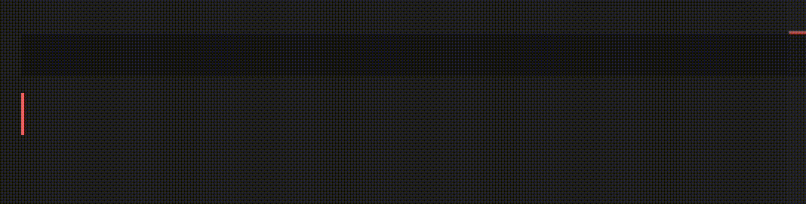
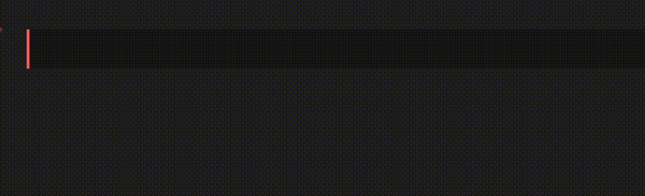
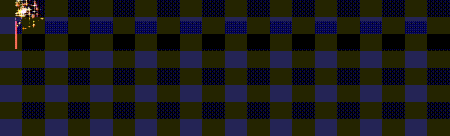
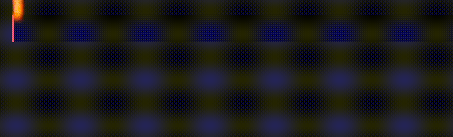
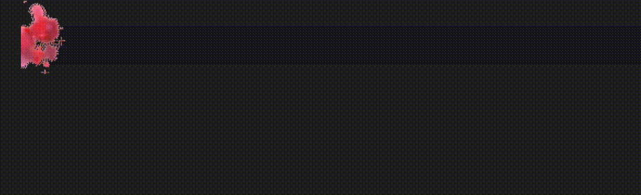
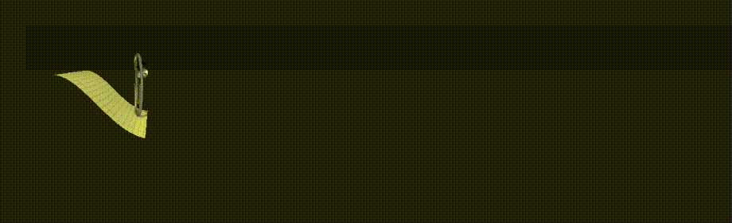
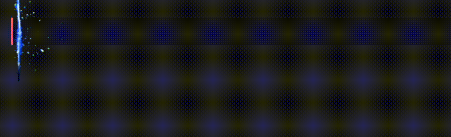
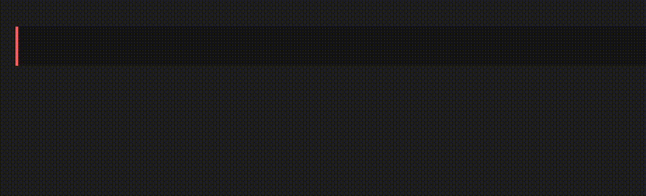

<p align="center">

</p>

<h1 align="center">Power Mode Plus <sup>VS Code</sup></h1>

<a href="https://marketplace.visualstudio.com/items?itemName=octohash.powermode-plus" target="__blank"></a>
<a href="https://kermanx.github.io/reactive-vscode/" target="__blank"></a>

> [!IMPORTANT]
> This is a fork of [`vscode-power-mode`](https://github.com/hoovercj/vscode-power-mode) by [@hoovercj](https://github.com/hoovercj). All credit goes to the original author and its contributors.

<p align='center'>

</p>

## Improvements

This fork includes fixes and enhancements based on community contributions from the original repository:

### Fixed: Combo Meter Positioning Issue

The original extension had a combo meter positioning issue in VS Code v1.88.x or higher due to style changes. This fork incorporates a fix based on [PR #114](https://github.com/hoovercj/vscode-power-mode/pull/114) contributed by [@slowquery](https://github.com/slowquery).

If you are using [Custom CSS and JS Loader](https://marketplace.visualstudio.com/items?itemName=be5invis.vscode-custom-css) with the following CSS:

```css
.monaco-editor .lines-content > .view-lines > .view-line > span {
  width: inherit;
}
```

You can adjust the combo meter position using the `powermode.combo.customCss` configuration to achieve the original extension behavior:

> [!NOTE]
> If you use percentage-based `right` positioning, you should enable `"editor.wordWrap": true` to prevent horizontal scrollbars from pushing the combo meter outside the visible viewport.

```json
{
  "editor.wordWrap": true,
  "powermode.combo.customCss": {
    "right": "5%",
    "left": "auto"
  }
}
```

The current default value is `"left": "calc(100vw - 35rem)"`, which looks good in most cases but cannot dynamically adjust its position when dragging the right sidebar.

### Fixed: Combo Meter Decoration Flickering

The original extension had a flickering issue with the combo meter decoration. This was caused by the previous combo decoration being disposed before the new one was created. This fork incorporates a fix based on [PR #106](https://github.com/hoovercj/vscode-power-mode/pull/106) contributed by [@ao-shen](https://github.com/ao-shen), which ensures the previous decoration is only disposed after the new one is created and rendered.

### Enhanced: Custom CSS Support

With the `powermode.combo.customCss` configuration support, you can easily customize the combo meter's appearance. For example, you can change the font family:

```json
{
  "powermode.combo.customCss": {
    "font-family": "Monaspace Argon"
  }
}
```

You can apply any CSS properties to fully personalize the combo meter to match your editor theme and preferences.

For a complete VSCode setup example with custom CSS and JS configurations, you can refer to my [vscode-config](https://github.com/jinghaihan/vscode-config).

## Installation

Search for **"power mode plus"** in your editor's extension marketplace:

- [VS Code Marketplace](https://marketplace.visualstudio.com/items?itemName=octohash.powermode-plus)
- [Open VSX Registry](https://open-vsx.org/extension/octohash/powermode-plus) (for VS Code forks)
- [GitHub Releases](https://github.com/jinghaihan/vscode-power-mode/releases) (download `.vsix` file)

## Explosions

### Particles

<p align='center'>

</p>

### Fireworks

<p align='center'>

</p>

### Flames

<p align='center'>

</p>

### Magic

<p align='center'>

</p>

### Clippy

<p align='center'>

</p>

### Simple Rift

<p align='center'>

</p>

### Exploding Rift

<p align='center'>

</p>

## Configuration

> [!NOTE]
> This extension inherits the configuration options from the original [`vscode-power-mode`](https://github.com/hoovercj/vscode-power-mode). However, deprecated configuration options from the original extension have been removed.

<!-- configs -->

| Key                                     | Description                                                                                                                                                                                                          | Type        | Default       |
| --------------------------------------- | -------------------------------------------------------------------------------------------------------------------------------------------------------------------------------------------------------------------- | ----------- | ------------- |
| ▿ <b>General</b>                        |
| `powermode.enabled`                     | Enable to activate POWER MODE!!!                                                                                                                                                                                     | `boolean`   | `false`       |
| `powermode.presets`                     | Choose between different preset gifs to use when powermode is activated                                                                                                                                              | `string`    | `"particles"` |
| ▿ <b>Combo</b>                          |
| `powermode.combo.location`              | Control where all the combo information is visible.                                                                                                                                                                  | `string`    | `"default"`   |
| `powermode.combo.threshold`             | The combo number needed to activate POWER MODE!!! and start shaking and exploding the screen! If the value is 0, POWER MODE will always be active.                                                                   | `number`    | `0`           |
| `powermode.combo.timeout`               | The number of seconds before the combo resets. If the value is 0, the timer will never reset.                                                                                                                        | `number`    | `10`          |
| `powermode.combo.counterEnabled`        | Control whether the combo counter is visible.                                                                                                                                                                        | `string`    | `"default"`   |
| `powermode.combo.counterSize`           | Control the size of the Combo Meter text                                                                                                                                                                             | `number`    | `3`           |
| `powermode.combo.timerEnabled`          | Control whether the combo timer is visible.                                                                                                                                                                          | `string`    | `"default"`   |
| `powermode.combo.customCss`             | Set custom CSS that will apply to the combo element.                                                                                                                                                                 | `object`    | `{}`          |
| ▿ <b>Shake</b>                          |
| `powermode.shake.enabled`               | Set to false to disable shaking while typing                                                                                                                                                                         | `boolean`   | `true`        |
| `powermode.shake.intensity`             | The intensity with which the screen shakes                                                                                                                                                                           | `number`    | `3`           |
| ▿ <b>Explosions</b>                     |
| `powermode.explosions.enabled`          | Set to false to disable explosions while typing                                                                                                                                                                      | `boolean`   | `true`        |
| `powermode.explosions.maxExplosions`    | The maximum number of simultaneous explosions                                                                                                                                                                        | `number`    | `1`           |
| `powermode.explosions.size`             | The size of the explosions. For value X, the height is set to X rem and the width to X ch                                                                                                                            | `number`    | `6`           |
| `powermode.explosions.frequency`        | The number of key strokes needed to trigger an explosion. 2 means every second keystroke will explode, 1 means every key stroke.                                                                                     | `number`    | `2`           |
| `powermode.explosions.offset`           | The vertical offset of the explosions. Increasing it will move the explosions up, decreasing it will move them down.                                                                                                 | `number`    | `0.35`        |
| `powermode.explosions.customExplosions` | This value will go into the 'url()' part of a background image. It should be a base64 encoded gif or **https** URL _without_ quotes.                                                                                 | `array`     | `[]`          |
| `powermode.explosions.backgroundMode`   | Affects the css properties used to display the gif.                                                                                                                                                                  | `string`    | `"mask"`      |
| `powermode.explosions.gifMode`          | Control the 'playback' mode of the gifs.                                                                                                                                                                             | `string`    | `"continue"`  |
| `powermode.explosions.explosionOrder`   | Determines how the explosions are cycled. 'random' (default) picks from the list randomly. 'sequential' goes through the list in order, and a number will select the explosion at that (zero based)index in the list | `undefined` | `"random"`    |
| `powermode.explosions.duration`         | Determines how long an explosion lasts (in milliseconds). Set to 0 for it to last forever.                                                                                                                           | `number`    | `1000`        |
| `powermode.explosions.customCss`        | Set custom CSS that will apply to the explosion element.                                                                                                                                                             | `object`    | `{}`          |

<!-- configs -->

## Commands

<!-- commands -->

| Command                      | Title              |
| ---------------------------- | ------------------ |
| `powermode.enablePowerMode`  | Enable Power Mode  |
| `powermode.disablePowerMode` | Disable Power Mode |

<!-- commands -->

## License

[MIT](./LICENSE) License © [jinghaihan](https://github.com/jinghaihan)
